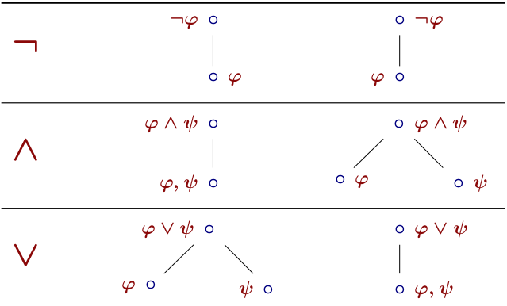
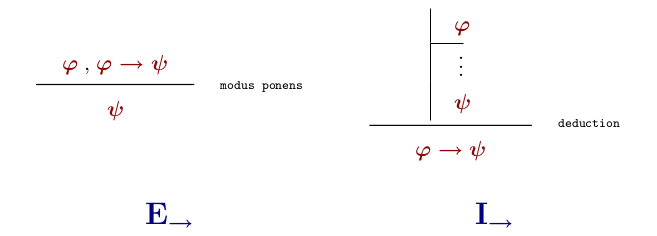
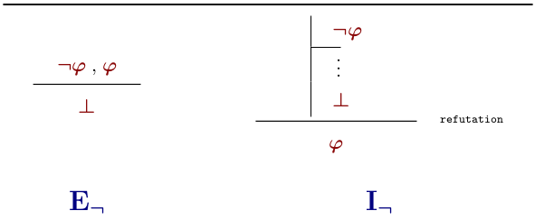
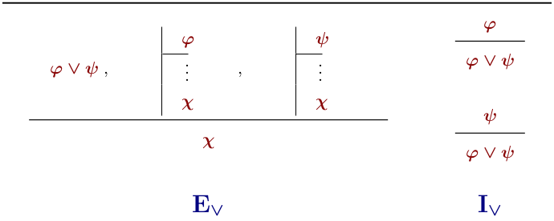

---
title: "Logic Tutorial 1"
author: ["David Pomerenke"]
institute: ["[linktr.ee/davidpomerenke](https://linktr.ee/davidpomerenke)"]
...

# Overview

- 16:00 How to learn
- 16:10 Recap
- 16:20 __Q&A__
- 16:50 Quiz
- 17:00 __Q&A__
- 18:00 Feierabend

# How to learn (0/3)

[msvincognito.github.io/survivingdke](https://msvincognito.github.io/survivingdke/)

# How to learn (1/3): Exercise

[msvincognito.nl/wiki](https://msvincognito.nl/wiki/study/bachelor/year_1/block_5/logic)

{width=70%}

# How to learn (2/3): Self-study

[Z-Libary](https://b-ok.cc), [Library Genesis](https://libgen.is/)

{width=90%}

# How to learn (2/3): Self-study

# How to learn (3/3): Spaced repetition

# How to learn (3/3): Spaced repetition

{width=70%}

{width=70%}

# How to learn (3/3): Spaced repetition

# How to learn (3/3): Spaced repetition

[Anki](https://apps.ankiweb.net/)

{width=60%}

# How to learn (3/3): Spaced repetition

[RemNote](https://remnote.io)

::: columns

::: column

:::

::: column

:::

:::

# How to learn (3/3): Spaced repetition

[ncase.me/remember](https://ncase.me/remember/)

# How to learn

1. Exercise
2. Self-study
3. Spaced repetition

# Semantic Tableau

{width=70%}

{width=70%}

# Natural deduction

::: columns

::: {.column width=60%}

:::

::: {.column width=35%}

:::

:::

# Q & A

[excalidraw](https://excalidraw.com/)

# Q & A

{width=30%}

# Q & A

::: columns

::: column

:::

::: column

:::

:::

# Q & A

::: columns

::: {.column width=60%}

:::

::: {.column width=40%}

:::

:::

# Q & A - Mock exam 2016 (Incognito Wiki) - 3 a)

{width=70%}

# Q & A - Mock exam 2016 (Incognito Wiki) - 3 b)

{width=50%}

# Q & A

{width=40%}

# Quiz

- [Kahoot](https://create.kahoot.it/details/461e6399-c19c-4a35-aa50-046bcbf6e9f3)
- [Tahook](https://tahook.netlify.app/)

# Feedback

Anonymous feedback form: 

- [linktr.ee/davidpomerenke](https://linktr.ee/davidpomerenke)
