---
title: "Logic Tutorial 2"
author: ["David Pomerenke"]
institute: ["[linktr.ee/davidpomerenke](https://linktr.ee/davidpomerenke)"]
...

# Overview

- 16:00 What's it all good for?
- 16:10 Recap
- 16:20 __Q&A__
- 16:50 Quiz
- 17:00 __Q&A__ ->
- 18:00 Feierabend

# What's it all good for? -- Studies

Bachelor

- Reasoning techniques
- Logic for AI (elective)
- Prolog (elective)
  
Master

- Foundations of Agents
- Master projects

Logic master Amsterdam, Munich

# What's it all good for? -- Studies

Programming paradigms

- __Imperative:__ C, Java, Python, Javascript
- __Functional:__ Elm, Scala, Haskell, Racket
- __Relational:__ \color{purple} Prolog

# What's it all good for? -- Studies

(img/masterproject.png){width=100%}

# What's it all good for? -- Industry

- Expert systems, decision support systems
  - Law: _Neota Logic, Bryter, LegalOS, KnowledgeTools_
- ...

# What's it all good for? -- Research

__Symbolic AI [Explainable AI]__ _(vs neural AI)_

- Probabilistic logic programming
- Neural logic programming
- Relational machine learning
  - Inductive logic programming
- Neuro-symbolic learning
- Answer set programming
- ...

# What's it all good for? -- Summer schools

~~[Law and logic](https://lawandlogic.org/)~~

[Logic, language and information](https://www.esslli.eu/)

~~[Logic and formal epistemology](https://www.cmu.edu/dietrich/philosophy/undergraduate/summer-school/)~~

~~[Contemporary logic, rationality and information](https://splogic.org/)~~

[Probability and logic](https://www.fatil.philosophie.uni-muenchen.de/events/defence_inductive_logic/index.html)

[Mathematical philosophy for female students](https://www.mathsummer.philosophie.uni-muenchen.de/index.html)

- [More extensive list by UvA](https://www.illc.uva.nl/NewsandEvents/Events/Conferences/)

# Square of opposition

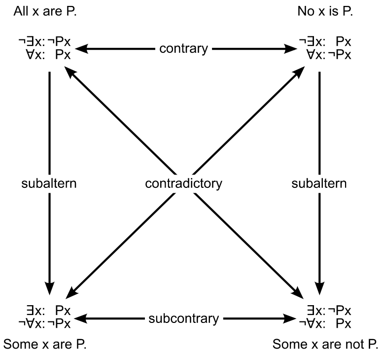{height=80%}

# Semantic Tableau

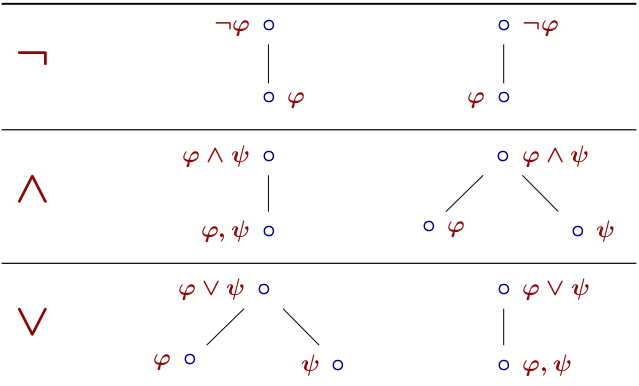{width=50%}

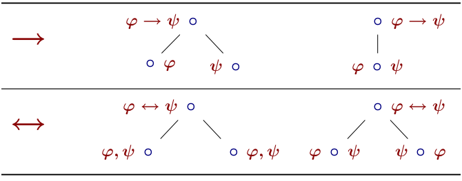{width=50%}

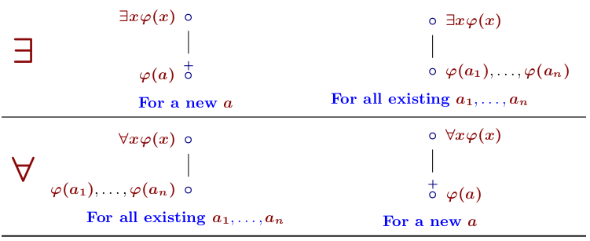{width=50%}

# Natural deduction

::: columns

::: {.column width=60%}
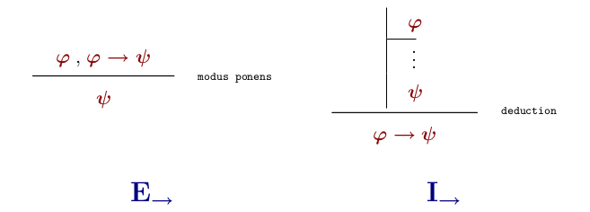

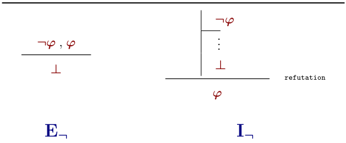

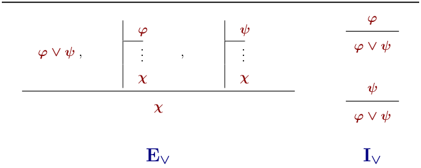
:::

::: {.column width=35%}
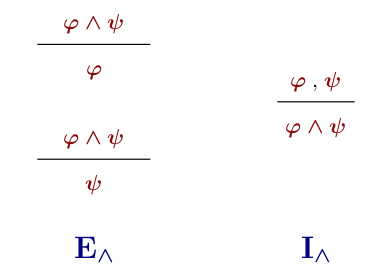
:::

:::

# Natural deduction

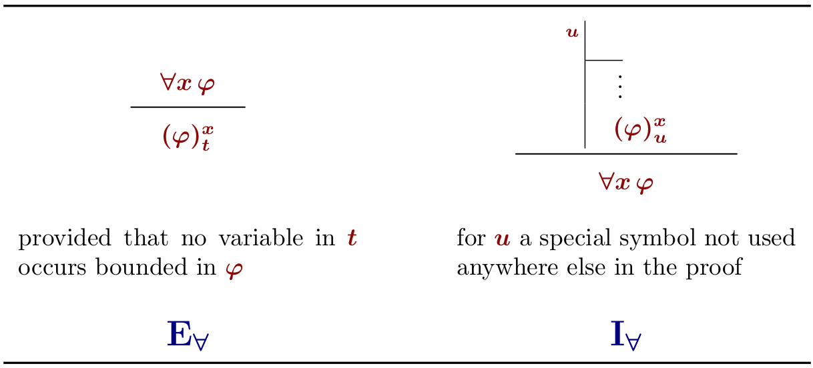{width=50%}

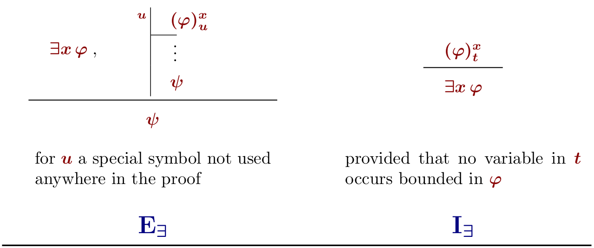{width=50%}

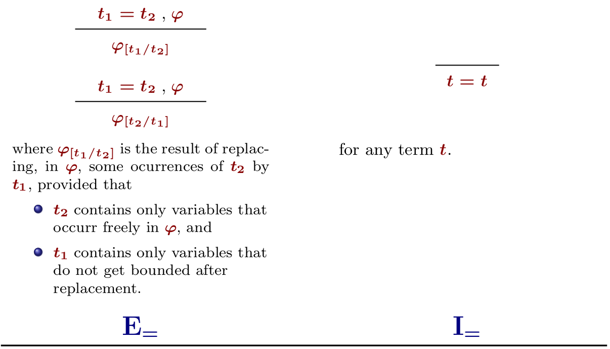{width=50%}

# Q & A

[excalidraw](https://excalidraw.com/)

# Q&A - "Moving in" the negation

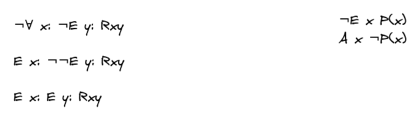

# Q&A - Syllogism

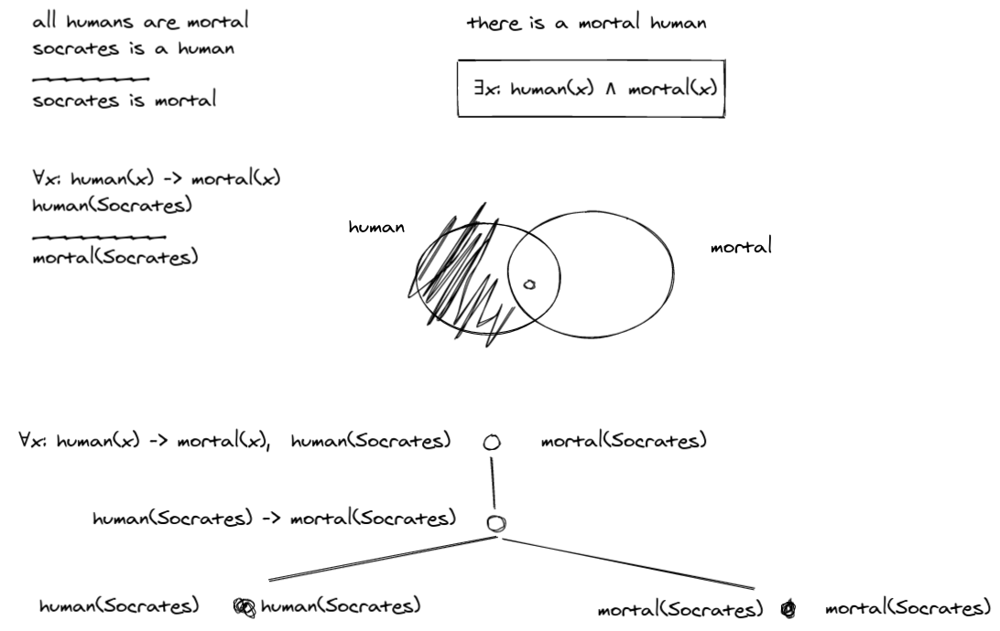

# Q&A - (Counter)examples in a semantic tableau

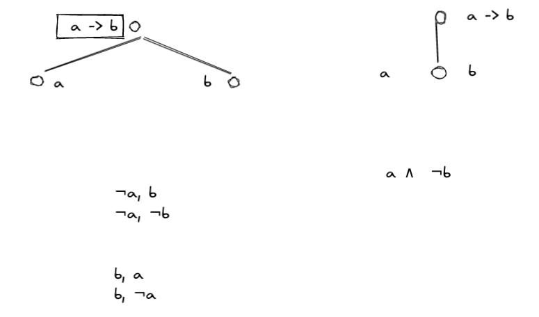

# Q&A - Proving validity, invalidity, satisfiability in a semantic tableau

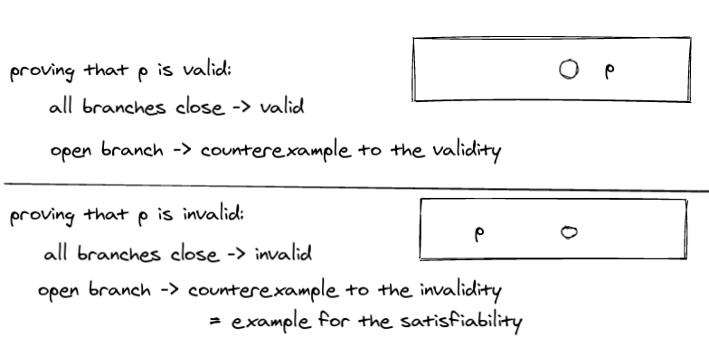

# Q&A - Order of rule application in semantic tableaux

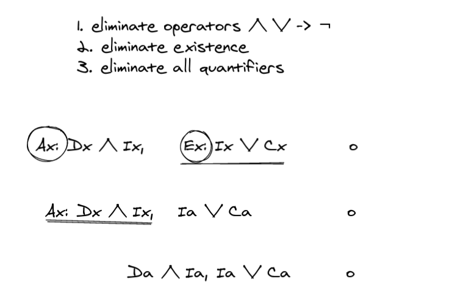

# Q&A - Natural deduction

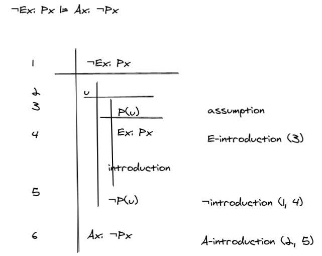

# Q&A - Examples for the natural deduction rules for predicate logic

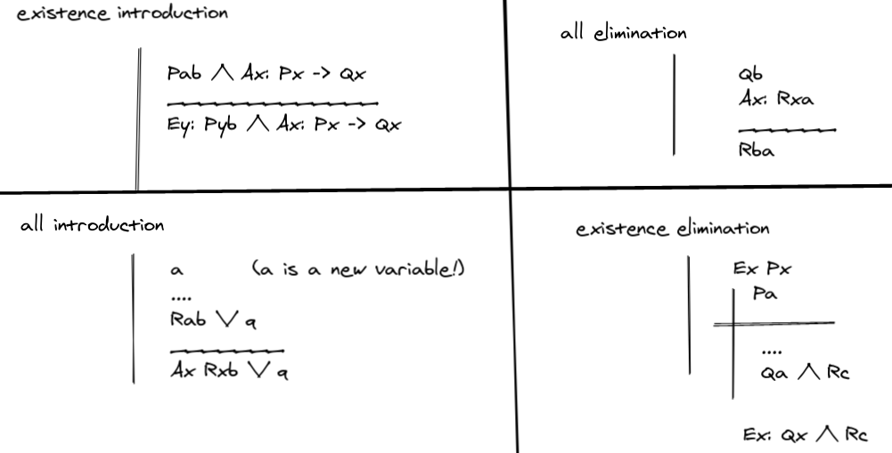

# Quiz

- [Tahook](https://tahook.netlify.app/)

# Feedback

Anonymous feedback form: 

- [linktr.ee/davidpomerenke](https://linktr.ee/davidpomerenke)
