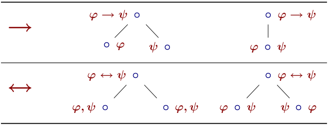
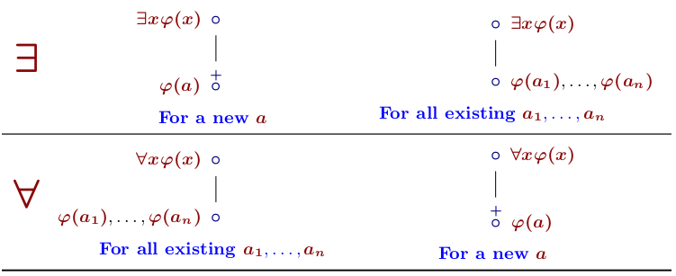
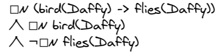
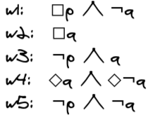
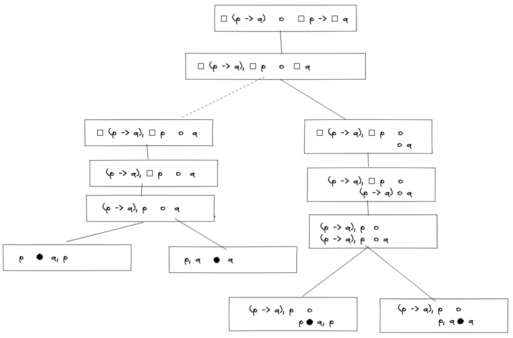

---
title: "Logic Tutorial 3"
author: ["David Pomerenke"]
institute: ["[linktr.ee/davidpomerenke](https://linktr.ee/davidpomerenke)"]
...

# Overview

- 11:00 Criticisms of logic
- 11:05 Recap
- 11:10 __Q&A__
- 11:50 Quiz
- 12:00 __Q&A__
- 13:00 Nap time

# Reminder

- Practice old exams!

{width=20%}

# Criticisms of logic

{width=70%}

# Criticisms of logic

- The logic research community is not inclusive.

- Logic is "a thought like a hammer" (authoritarian, patriarchal).

[{width=30%}](https://b-ok.cc/book/5443608/c8ccb8)

# Criticisms of logic - Reactions

- The logic research community is not inclusive.
  - [Women in Logic](http://womeninlogic.blogspot.com/)
  - [Summer school in mathematical philosophy for female students](https://www.mathsummer.philosophie.uni-muenchen.de/index.html)
- Logic is "a thought like a hammer" (authoritarian, patriarchal).
  - Taking into account uncertainty
    - Probability theory
    - Ranking theory
  - Taking into account exceptions and counterarguments
    - Formal argumentation, defeasible logic
  - Taking into account inconsistencies
    - Catuskoti

# Catuskoti / Paraconsistent logic

# Recap

- Epistemic logic
- Dynamic logic

# Accessibility relations

# Semantic Tableau

{width=50%}

{width=50%}

{width=50%}

# Semantic Tableau - Modality

{width=100%}

# Q&A - Flipping operators

{width=50%}

# Q&A -  Mock exam 2016 (Incognito Wiki) - 8 c)

{width=50%}

# Q&A -  Mock exam 2016 (Incognito Wiki) - 9 a)

{width=30%}

# Q&A -  Mock exam 2016 (Incognito Wiki) - 10

# Quiz

- [Tahook](https://tahook.netlify.app/)

# Feedback

Anonymous feedback form: 

- [linktr.ee/davidpomerenke](https://linktr.ee/davidpomerenke)
